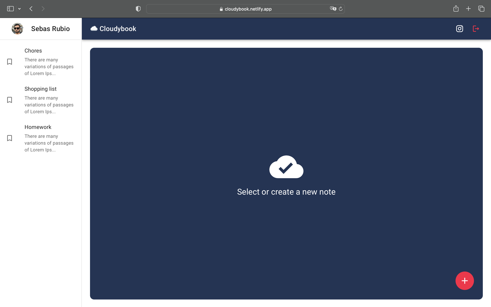

<center></center>

# Cloudbook ☁️📝

🔗 [Official Site](https://cloudybook.netlify.app/)

Cloudbook let you create and store notes in the cloud for free. Don't worry about which device are you writing your notes, with your account them will be available in any device!

Create your account is easy, you only need your email and password, or if you want, you can register and login with your Google account.

What are you waiting for? Use it now!

<center></center>

<br>

# Devs zone 🧑🏽‍💻

This web app is open source. Whether you want to contribute or just learn, you can use it. Feel free to fork!

## Tech stack and topics

- React.js
- Redux
- Firebase
- Firestore
- Google Auth
- MaterialUI
- SPA
- React Router Dom v6
- Sweet alert 2
- Custom Hooks

## Run Locally

Clone the project

```bash
  git clone https://github.com/4ubio/Cloudybook.git
```

Go to the project directory

```bash
  cd Cloudybook/
```

Install dependencies

```bash
  yarn
```

Start the server

```bash
  yarn dev
```

```bash
  yarn host
```